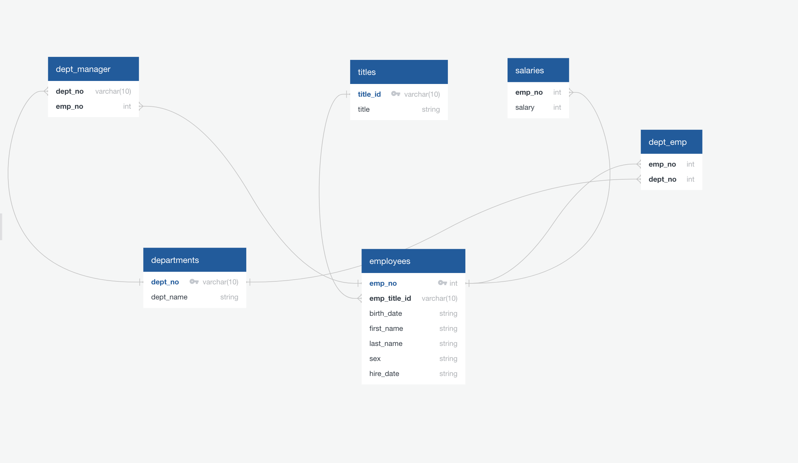

# sql-challenge

Image of Employee database ERD for reference (image located in employee-sql file as well). All SQL files for the creation of tables and queries are located in employee-sql. CSV files are located in data file. 

